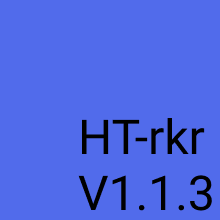

# Hand_tracker(HT-rkr) v.1.1.3
This is a python code that will track your hands position in real time

NOTE: you have to install everything listed in the requirements folder
in order for the application to run.

If for whatever reason you don't know how to run
the application do this: 

1- Open CMD or the terminal in the directory which the file is located in

2- And then type this ---> python3 main.py | then press enter
